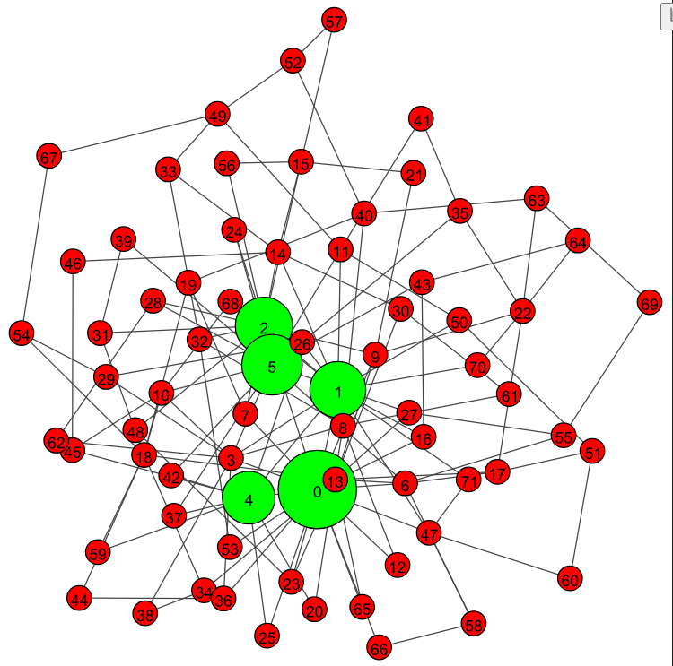
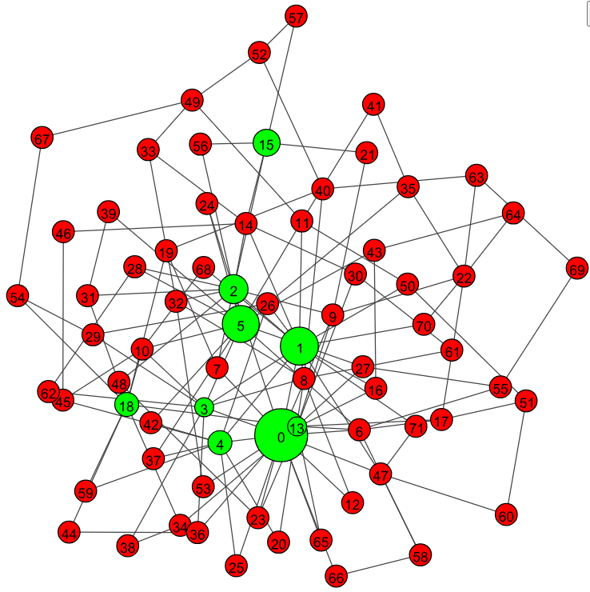

          
# 带有传播源头标识的图节点相关性及中心节点计算算法

## 算法概述

本文档介绍了一种基于图传播的节点相关性分析算法，该算法通过带有源头标识的信息传播机制，计算图中节点间的相关性，并识别图的中心节点。算法核心实现在`Gds`(Graph Diffusion with Source)类中，使用igraph库进行图数据结构处理。

## 核心类与数据结构

### Gds类

`Gds`类是算法的核心实现，包含了图初始化、信息传播、归一化和中心节点计算等功能。
这个类里初始化之后从外部传入图G，图的节点有个属性r_msg，存储节点的关联消息。

```python
class Gds():
    def __init__(self, G):
        # 图初始化代码
```

### 数据结构
- `r_msg`: 存储节点的关联消息，以JSON格式存储的字典，键为源节点ID，值为关联度
- `buffer`: 存储邻居节点传播来的消息缓冲区。目的实现并行化传输。
- `id_nodeid_dict`: 顶点vertex ID到节点node_id 的映射
- `nodeid_id_dict`: 节点node_id到顶点vertex ID的映射

## 传播算法原理

### 1. 初始化

```python
def __init__(self, G):
    self.G = G
    self.df_vertexs = self.G.get_vertex_dataframe()
    # 创建ID映射
    self.id_nodeid_dict = self.df_vertexs.set_index('vertex ID')['node_id'].to_dict()
    self.nodeid_id_dict = {v: k for k, v in self.id_nodeid_dict.items()}
    # 初始化节点属性
    self.G.vs["r_msg"] = json.dumps({})
    self.G.vs["buffer"] = json.dumps([])
    # 设置传播参数
    self.FADE = 0.3  # 消息衰减系数
    # 根据节点数量设置其他参数
```

### 2. 添加源节点

```python
def add_one_node_ids(self, node_ids):
    for node_id in node_ids:
        vid = self.nodeid_id_dict[node_id]
        node = self.G.vs[vid]
        origin_msg = json.loads(self.G.vs[int(vid)]["r_msg"])
        # 添加源节点消息
        add_msg = {str(node_id): 1}
        origin_msg.update(add_msg)
        # 合并消息并更新
        buffer = []
        buffer.append(add_msg)
        buffer.append(origin_msg)
        merged_dict = merge_dicts_with_sum(buffer)
        node['r_msg'] = json.dumps(merged_dict)
    self.normalize()
```

### 3. 消息传播机制


#### 从指定节点传播
制定一系列节点 node_ids, 将每个节点的 ‘r_msg'属性设置为 {node_id: 1}
    - node_id: 节点标识
    - 1：源节点传来的权重
```python
def add_one_node_ids(self, node_ids):

```

#### 全局传播到缓冲区

每个节点的消息传播到其邻居节点的缓冲区
```python
def merge_from_buffer(self):

```
这样每个节点的缓冲区就会储存所有邻居节点的消息，形成一个消息列表。
### 4. 消息合并与归一化
<!-- 从缓冲区合并消息 -->

```python
def merge_from_buffer(self):

```

### 归一化函数

```python
def normalize(self):

```

### 中心节点计算算法

```python
def show_central(self):

    return filtered_dict
```

### 可视化功能

```python
def show_nodes(self, node_data):

```

## 算法参数

- `FADE`: 消息传播衰减系数，默认值为0.3
- `LIMIT`: 关联度过滤阈值，默认值为`3*(1/节点数)`
- `MIN_SIZE`/`MAX_SIZE`/`DEFAULT_SIZE`: 节点可视化大小参数

## 算法流程

1. 初始化图和参数
2. 添加源节点，设置初始消息
3. 执行消息传播（单次或多次迭代），传播消息到缓冲区。
4. 合并缓冲区消息
5. 归一化节点消息
6. 计算中心节点
7. 可视化结果

## 使用示例
见 tests\test.ipynb
| 图中心节点 |  
|----------|
|   |

| 节点 ’15’,’63’ 相关节点|  
|----------|
|   |

## 算法特点

1. **源头标识**: 消息中保留了源节点的标识，可追踪信息传播路径
2. **衰减机制**: 消息在传播过程中会衰减，避免远距离节点影响过大
3. **动态阈值**: 根据节点数量动态调整关联度过滤阈值
4. **可视化**: 提供节点重要性可视化功能
5. **归一化**: 确保节点消息总和为1，便于比较

此算法适用于社交网络分析、欺诈检测、推荐系统等场景，可有效识别图中的关键节点和社区结构。
        