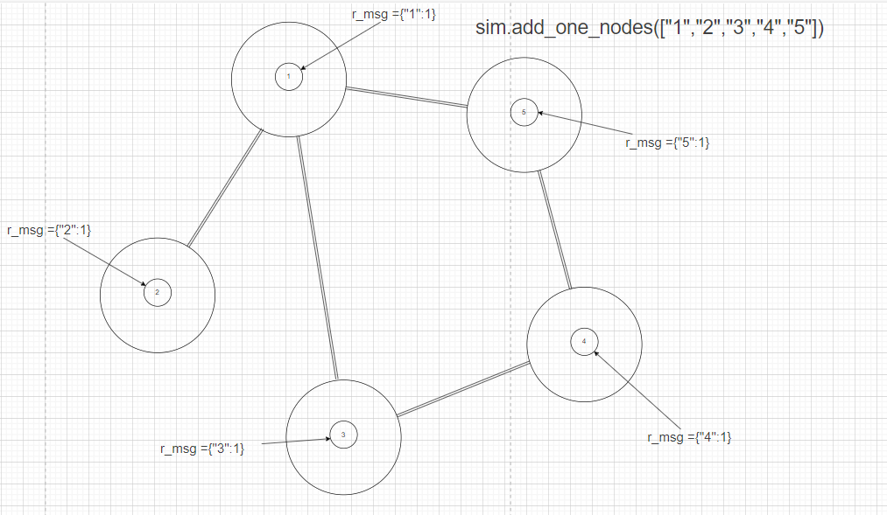
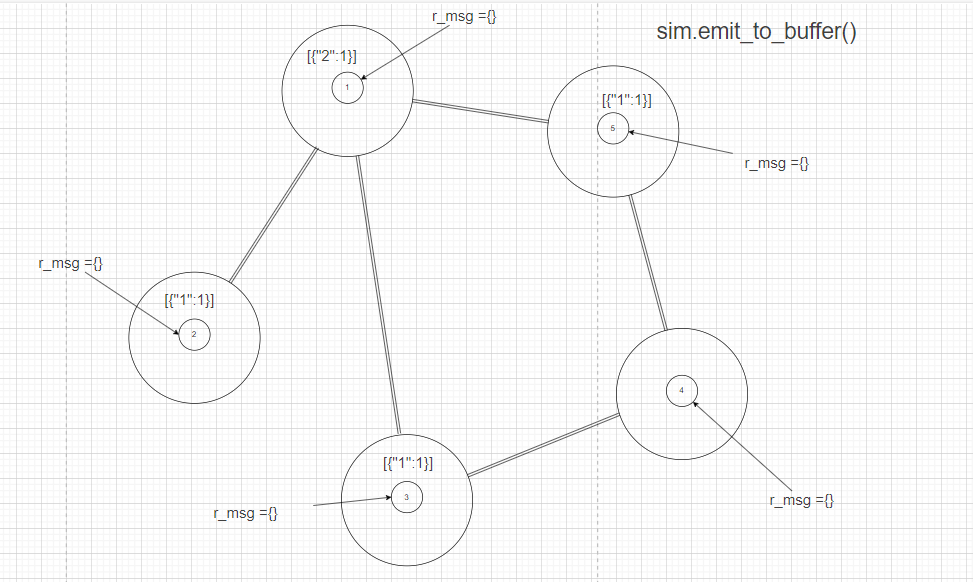
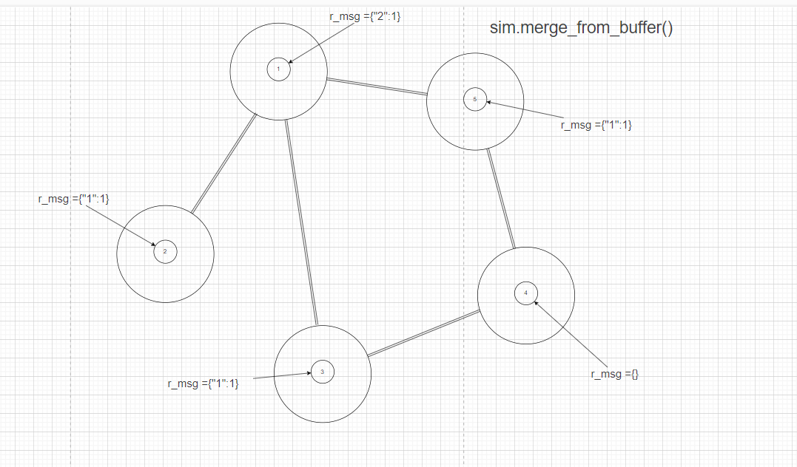

## Graph Diffuse with Source 库 图示说明：
### 一、 寻找中心节点：
    1. sim.add_one_node_ids(source_nodes)
        - 给每个节点添加一个r_msg属性，属性值为{node_id:1}。
        

    
    
    
    

    
    2. sim.emit_to_buffer(source_nodes)
        - 每个节点向邻近节点的buffer发送消息，消息内容为本节点的r_msg属性值。
        - 每个节点的r_msg属性值清空。

    3. sim.merge_from_buffer()
        - 每个节点从buffer中接收消息，将消息合并到本节点的r_msg属性值中。

    
    4. 重复以上步骤合适的次数。（一般3次足够了）
    5. sim.show_central()
        - 每个节点计算所有节点的r_msg属性值的汇总值，根据不同的key分别汇总。
        - 汇总之后归一化
        - 去掉小于某个阈值的key:value对。
        - 再次归一化
        - 输出结果，key即为关键中心节点的node_id。

---
---

### 二、 寻找关联节点（以1，2 节点的关联节点为例）：

    1. sim.add_one_node_ids(["1","2"])

        - 给1，2 节点添加一个r_msg属性，属性值为{node_id:1}。
        

    
    
    
    

    
    2. sim.emit_to_buffer(source_nodes)
        - 每个节点向邻近节点的buffer发送消息，消息内容为本节点的r_msg属性值。
        - 每个节点的r_msg属性值清空。

    3. sim.merge_from_buffer()
        - 每个节点从buffer中接收消息，将消息合并到本节点的r_msg属性值中。

    4. 重复以上步骤合适的次数。（一般3次足够了）
    5. sim.show_central()
        - 每个节点计算所有节点的r_msg属性值的汇总值，根据不同的key分别汇总。
        - 汇总之后归一化
        - 去掉小于某个阈值的key:value对。
        - 再次归一化
        - 输出结果，key即为关键中心节点的node_id。

    
