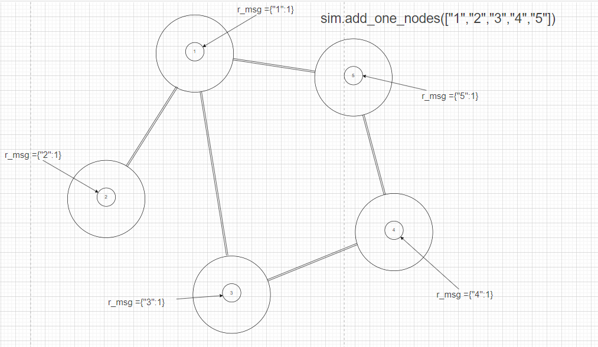
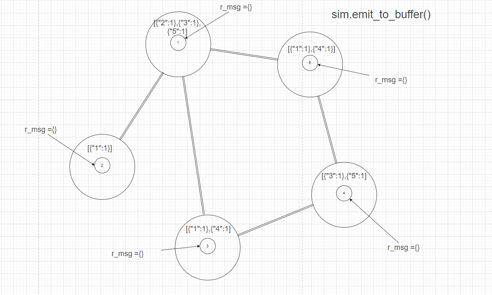
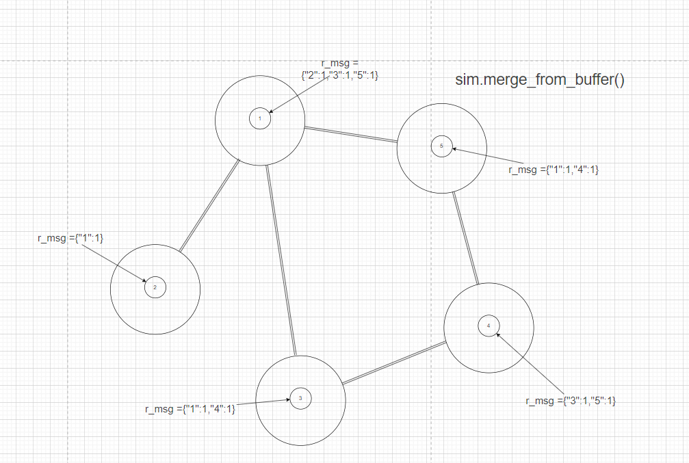
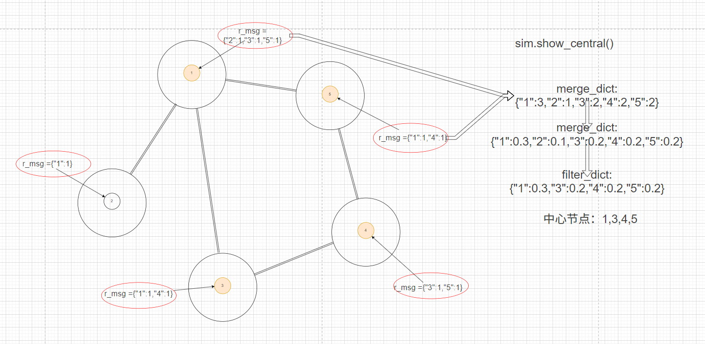
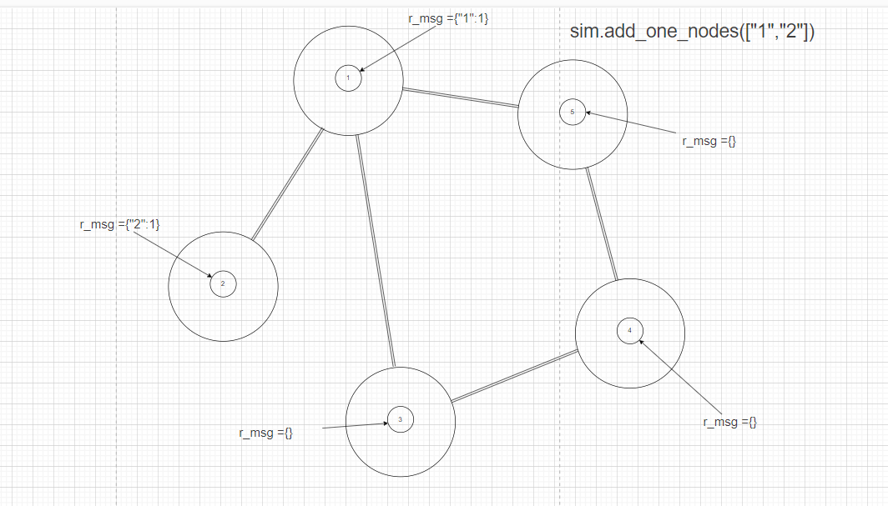
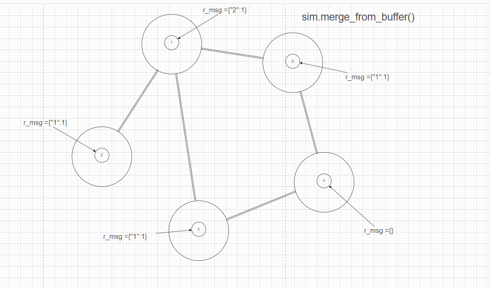
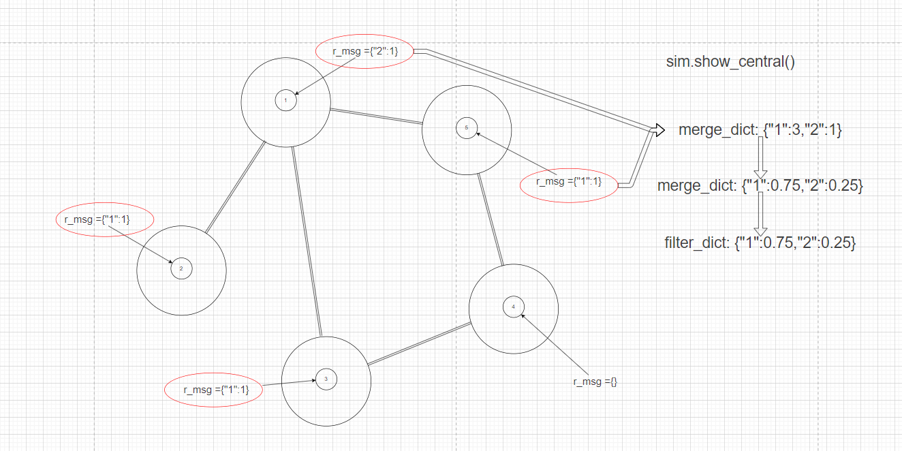

## Graph Diffuse with Source Library Diagram Explanation:
### I. Finding Central Nodes:
    1. sim.add_one_node_ids(source_nodes)
        - Add an r_msg attribute to each node with the value {node_id:1}.
        

    
    2. sim.emit_to_buffer(source_nodes)
        - Each node sends a message to the buffer of its neighboring nodes, with the message content being the r_msg attribute value of the node.
        - The r_msg attribute value of each node is cleared.

    3. sim.merge_from_buffer()
        - Each node receives messages from the buffer and merges them into its r_msg attribute value.

    
    4. Repeat the above steps an appropriate number of times. (3 times is generally sufficient)
    5. sim.show_central()
        - Each node calculates the sum of r_msg attribute values for all nodes, summing separately based on different keys.
        - Normalize after summing
        - Remove key:value pairs smaller than a certain threshold.
        - Normalize again
        - Output the results, where the key is the node_id of the key central node.

---
---

### II. Finding Associated Nodes (Taking the associated nodes of nodes 1 and 2 as an example):

    1. sim.add_one_node_ids(["1","2"])

        - Add an r_msg attribute to nodes 1 and 2 with the value {node_id:1}.
        

    
    2. sim.emit_to_buffer(source_nodes)
        - Each node sends a message to the buffer of its neighboring nodes, with the message content being the r_msg attribute value of the node.
        - The r_msg attribute value of each node is cleared.

    3. sim.merge_from_buffer()
        - Each node receives messages from the buffer and merges them into its r_msg attribute value.

    4. Repeat the above steps an appropriate number of times. (3 times is generally sufficient)
    5. sim.show_central()
        - Each node calculates the sum of r_msg attribute values for all nodes, summing separately based on different keys.
        - Normalize after summing
        - Remove key:value pairs smaller than a certain threshold.
        - Normalize again
        - Output the results, where the key is the node_id of the key central node.

